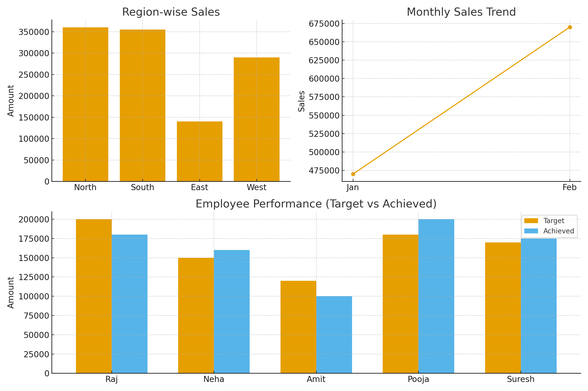

# MIS Dashboard Project

This project demonstrates a comprehensive **MIS Dashboard** built using sample sales, customer, and employee data. It highlights key insights, trends, and performance metrics in an interactive and visually appealing format.

## Project Contents

- **MIS_Project_Guide.pdf** – Step-by-step guide explaining the project, data flow, and dashboard features.  
- **CSV Files** – Raw data used for analysis:  
  - `customers_data.csv`  
  - `employees_data.csv`  
  - `sales_data.csv`  
- **Dashboard Image** – Screenshot of the final MIS Dashboard showcasing visualizations and insights.

## Key Features

- **Sales Analysis:** Track sales performance over time, by region, and by product.  
- **Customer Insights:** Analyze customer demographics, purchase patterns, and trends.  
- **Employee Performance:** Compare achieved sales against targets for each employee.  
- **Interactive Dashboard:** Filters for region, product type, and time period to explore the data dynamically.  

## Tools & Technologies

- Microsoft Power BI for dashboard visualization  
- Microsoft Excel / CSV files for data preparation  
- PDF for documentation and project guide  

## How to Use

1. Open the **MIS_Project_Guide.pdf** to understand the project structure and workflow.  
2. Load the CSV files (`customers_data.csv`, `employees_data.csv`, `sales_data.csv`) into Power BI.  
3. Open Power BI and recreate or explore the dashboard as per the guide.  
4. Use filters to interactively analyze sales, customer, and employee data.  

## Dashboard Preview

.

---

## Skills Highlighted

- MIS Reporting & Analysis  
- Data Cleaning & Preparation  
- Power BI Dashboard Design  
- KPI Tracking & Visualization  
- Data-driven Decision Making

